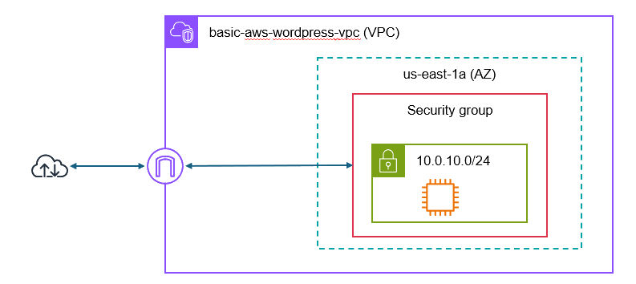

# Basic EC2 Lab


This repository contains the files necessary to build out
a (very) basic WordPress lab environment using Terraform.

This lab is only for basic testing purposes and
should NOT be used for any sensitive content.


## Resources included...
- VPC
- Subnets
- Internet Gateway
- Route Tables
- Security Group
- Key Pair
- EC2

The environment contains a single EC2 instance which is accessible from your IP
using SSH (port 22) and HTTP (port 80). A script is included to install and
configure WordPress. The script will execute when the EC2 instance is initially launched.

## Cost
Be sure to check the current free tier limitations on these
resources before building this environment.

## Prerequisites
This repository is focused on the deployment of infrastructure, 
not the setup of your environment. 


Ensure the following items are completed before attempting to implement this configuration.
- [Create an AWS account](https://johnstortajr.com/2023/10/08/create-aws-free-tier/)
- [Create an IAM user for your AWS account with the `AdministratorAccess` policy](https://johnstortajr.com/2023/10/08/create-aws-iam-user/)
- [Install Terraform on your local machine](https://developer.hashicorp.com/terraform/tutorials/aws-get-started/install-cli)
- [Install the AWS CLI](https://docs.aws.amazon.com/cli/latest/userguide/getting-started-install.html)
- [Create an AWS Access Key and Secret Key](https://johnstortajr.com/2024/02/10/create-aws-access-key/) (*be sure to save these keys*)
- [Configure the AWS CLI](https://awscli.amazonaws.com/v2/documentation/api/latest/reference/configure/index.html)
- [Create an S3 bucket for the Terraform state file](s3bucket.md) (*optional*)

## secrets.tfvars
This file contains values that you would not want uploaded to the GitHub repository.
This may include things like access keys, SSH keys, and local IP addresses. 
You will need a `secrets.tfvars` file that contains these sensitive values.
Refer to the [secrets.md](secrets.md) file for more information on this requirement.

## tf files
Terraform uses `.tf` files for the configuration. 
You can split your configuration up into as many, or as few, files as you desire. 
Terraform will view all files together as though they were one big file. Terraform tries
to infer dependencies based on the resources used and build the infrastructure in
the appropriate order.

Refer to the comments within each `.tf` file for specific information about what it contains.

It may be helpful to review the files in this order.
- `main.tf` Terraform initialization
- `variable.tf` Variable definitions 
- `network.tf` VPC, Subnets, Internet Gateway, Route Table, Routes
- `security-group.tf` Security group to allow access to the EC2 instances
- `accesskey.tf` SSH key for logging into the EC2 instances
- `instances.tf` EC2 configurations

## Deployment
Once all the prerequisites are completed and you have setup your `secrets.tfvars` file, use the following commands to check and deploy the configuration.

Initialize Terraform
```
terraform init
```

This will reformat your code to match Terraform standards. This code is already 
written to those standards, but you can run the command anyway to see the output.
```
terraform fmt
```

Validate that the configuration is good. This command checks the syntax, but does
not check that the configuration is valid.
```
terraform validate
```

Compare the desired configuration with the current active configuration and
report back what changes will be made to bring the active configuration in line
with what is desired. This command reports what will be done, but takes no action.
```
terraform plan -var-file="secrets.tfvars"
```

Execute the plan
```
terraform apply -var-file="secrets.tfvars"
```

The configuration will take several minutes for all the resources to be created and
for the EC2 instances to complete their checks. You can monitor the status in the 
AWS Management Console. 


## Access
Once the EC2 instances show that they are Running and have passed the checks, you
can access them from your local system using OpenSSH. 

The command provided here is a sample. Your DNS name will be different. You can get the `PUBLIC_DNS` for the instance from the AWS Management Console.

The default username for the AMI that we used is `ubuntu`.

You should be able to connect to the EC2 instance using the command below.
Note that the key you provide must be the private key from the key pair
you used when creating the instance.
```
ssh -i "~/.ssh/myprivatesslkey" ubuntu@ec2-00-11-22-333.compute-7.amazonaws.com
```

## Accessing WordPress
The `WP_Setup.sh` script was sent to the instance at launch and executed. 
Enter the DNS name for the instance in your browser. (use http, not https) If
the script completed successfully, then you should see the WordPress setup
screen where you can provide the initial details and visit the site.

This lab is about creating the WordPress infrastructure, not configuring WordPress itself.


## Cleanup
It is recommended that you only keep the environment as long as you need for 
your purposes. When you are done with it, you should destroy it.
```
terraform destroy -var-file="secrets.tfvars"
```